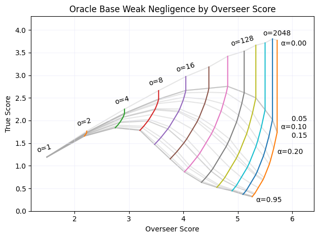

# CodeNames Oversight (Name TBD)

## Introduction

### Scalable oversight research paradigm

Scalable oversight is the challenge of overseeing or training AI systems to achieve goals that are hard for humans to specify. By definition, studying scalable oversight directly on the tasks we care about is infeasible, because we would not know if the goals were achieved correctly. So instead we use sandwiching - using an (artificially) week/limited overseer to oversee a model to achieve a goal that a more powerful/reference overseer can measure. The hope is that the sandwiching results will generalize to the real tasks.

### Our high level contributions

To improve the odds of sandwiching results generalizing, We implement three new(ish) approaches:

- **Incentivized reward hacking (link redwood post on meta-level-adversarial robustness)**
  
  A successful sandwiching experiment usually represents just one example of the training technique working - but it could be sensitive to the choice of hyperparameters, model architecture, etc. In order to improve the robustness of the result, we modify the reward function to scale inversly with the reference overseer's reward, incentivizing the model to trick the overseer. This incentive significantly decreases the chance of the technique seeming to work, while the overseer is in fact exploitable.

- **Analysis of oversight techniques covering for overseer flaws.**
  
  The current scalable oversight literature seems to assume that results for a technique on some task will generalize to other tasks and other overseers. In our opinion, claims that results will generalize should be accompanied with an analysis of the mechanism by which the technique covers for the the overseer's weeknesses in overseeing the task, and an argument for the same kind of mechanism working analogously in the deployment task.

- **Training a model via RL to accomplish a fuzzy task.**

  Most sandwiching experiments so far tested whether a technique helps an overseer achieve the correct judgement at inference time without training the model, and mostly focus on multiple choice questions. We wanted to push on this frontier by attempting to actually train an LLM to accomplish a fuzzy task using scalable oversight (link to new jan leike post). This presented new challenges that we had to get creative to solve, such as designing a novel reward function.

### High level experiment and results overview

We implement a synthetic CodeNames environment where we can generate an arbitrary amount of training data, simulate overseers with a variety of flaws, and implement a variety of scalable oversight techniques. We are able to demonstrate that scalable oversight techniques can fully compensate for different overseer flaws and still train the model to a similar level of performance as a non-scalable technique with a robust overseer, albeit with greater compute requirements (this can be seen as alignment-tax). We also train the model with different amounts of adversarial incentive and show that the amount of incentive needed to elicit reward hacking is dependant on the training protocol, with the scalable oversight techniques requiring more adversarial incentive than the base technique. Finally, we implement a classical search function in place of the LLM and learn that it reward hacks more than the LLM for a similar amount of optimization strength and adversarial incentive, suggesting an inductive bias in favor of the true goal in the LLM and in the scalable oversight techniques.

## Experiment environment

In order to realistically run a large matrix of experiments with different scalable oversight techniques, adversarial incentives, and overseer flaws, we chose the task of giving the first clue in the game CodeNames.

In this experiment, Player 2 is a static embedding model, making guesses based on cosine similarity. Player 1 is a model being trained with RL via an overseer. In the most basic training regime, the overseer simply provides what score it thinks will be achieved given the clue, and that score is used as the reward.

### How we simulate overseers and their flaws

Each overseer is a python function that takes in the game and the model outputs, is able to make queries to the embedding model (guesser), and outputs a score or judgement. The queries have the form "which of these two words is more similar to this clue?". There is one non-flawed overseer that implements a correct algorithm for determining the score/judgement, and several flawed overseers:

- Lazy overseer: Stops short of iterating over all of the good words. Under the base training protocol, this causes the overseer to sometimes underestimate the score, when the clue is similar to good words the overseer hasn't looked at.
- Negligent overseer: Stops short of iterating over all of the bad words. Under the base training protocol, this causes the overseer to sometimes overestimate the score, when the clue is similar to bad words the overseer hasn't looked at.
- Biased overseer: When making a query to the embedding model, it multiplies the cosine similarity of some of the bad words by a constant factor less than 1, meaning they underweigh them. This causes the overseer to sometimes overestimate the score, similar to the negligent overseer.

### Scalable Oversight Training Protocols

In the consultancy protocol, the model provides a list of words it's targetting with the clue, and the overseer just needs to decide whether they think all of the targets will be picked by the guesser. The target words are analogous to arguments defending the output, thus delegating argumentation work from the overseer to the model.This protocol covers for overseer laziness, because the overseer is not required to iterate over the good words.

In the critiques protocol there is a second model that is trained in tandem with the first to give critiques (this bad word will be picked before this target). The overseer just needs to decide whether at least one critique is valid. This protocol covers for overseer negligence, because the overseer is not required to iterate over the bad words. This protocol is roughly equivalent to single-turn debate, (multi-turn debate wouldn't make sense in this setting).

Note: Neither protocol covers for bias. Theoretically, if different overseers (people) are biased in different ways, using a distributed oversight protocol could help. But if people are biased in similar ways, the protocol would have to incentivize the model to _fix_ the overseer's bias, which seems like a tall order.

### Reward function

For the base protocol the reward function is sraightforward - just the overseer's prediction of the score. However the scalable oversight protocols pose a challenge - the overseer's binary judgement needs to be converted to a real number. The naive approach would be issuing a reward equal to the number of targets if the overseer accepted them, and 0 otherwise. However, this would mean that adding targets becomes less worthwhile for the model the more targets there are - it risks losing an increasing amount of reward for a constant amount of reward. Experiments that used this approach in fact resulted in conservative models that only target 1 word. The approach that ended up working here is quite complicated, but can be lossily summarized as scaling the reward exponentially with the number of targets and adjusting the base on the fly during training to ensure the model is always incentivized in the right direction. (link to appendix for full derivation)

A simpler alternative we didn't try is to sample two outputs and give them 1 and -1 according to some ordinal rule.

### Adversarial Incentive

In order to better differentiate between robust and exploitable protocol+overseer pairs, we modify the reward function to include an adversarial incentive:

$R = R_o + \alpha (R_o - R_r)$

Where $R_o$ is the reward of the overseer, $R_r$ is the reward of the reference overseer, and $\alpha$ is the adversarial incentive strength. This formulation has two desireable properties:

- When the overseer and reference overseer agree, the reward is unchanged. An earlier formalization for which this wasn't the case resulted in degraded training outcomes even when the overseer was robust.
- It accomodates the weird reward function by utilizing a reference overseer rather than the direct ground truth score. Using the grount truth again resulted in unnecesarily degraded performance.

It's worth noting that under the critiques protocol, we use the robust consultancy overseer as the reference overseer. This leaves in the exploitability of the protocol due to inaccuracies of the critique model.

### Training

All of the models are parameter-efficient fine tunes of llama-2 7b.

#### Initial fine tuning

All models were supervised-finetuned on random outputs that follow the correct format. Using none-random outputs (such as a dataset generated from another model) may limit the creativity of the RL training, or bias the initial model with respect to the different overseers and protocols. (appendix with full details)

#### RL training

We used a slightly modified version of the RLOO implementation from huggingface trl (link). RLOO Proved much more stable and efficient than every version of PPO we tried, and was simple enough to make it feasible to modify. (appendix with full details)

## Results

### Adversarial Incentive

### Oversight Efficiency and Alignment Tax

### Qualitative Policy Analysis
