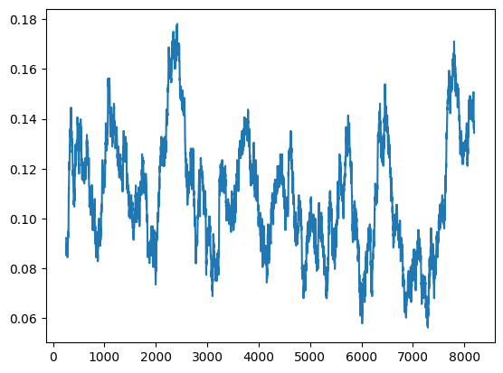

# CodeNames Debate

[CodeNames](<https://en.wikipedia.org/wiki/Codenames_(board_game)>) is a party card game where players need to find creative word associations. Can a language model learn to give good CodeNames clues when trained with RLAIF? Will it do better or worse when trained with Debate, and why?

I suspect that judging whether a clue is good during the debate game is harder than testing out whether it's good by playing as the receiver of the clue, because it's possible to make a clue seem good when it's actually bad. This lets me test out the main claim of the [debate paper](https://arxiv.org/abs/1805.00899): "In the debate game, it's harder to lie than to refute a lie". If training via debate gets results that are about as good as training via testing out the clue, that might be a good sign for debate as an alignment technique. If it does worse, that might be an opportunity to investigate the ways in which debate fails.

The main goal of this project is to get my feet wet with ML and have some fun with language models. I've fortunately been able to plan it such that the phases have ramping difficulty.

## Fine Tuning Phase (complete)

The goal of this phase is to fine tune an LLM (Llama-2-7b for now) so that it outputs CodeNames clues in the correct format. For training data, I used GPT-4 to generate clues for about 500 randomly generated games (see [generate_sft_dataset.py](codenames_debate/generate_sft_dataset.py)). For training I used SFTTrainer from the library [trl](https://github.com/huggingface/trl) (see [sft.py](codenames_debate/sft.py)). The training also uses [peft](https://github.com/huggingface/peft) and [bitsandbytes](https://github.com/TimDettmers/bitsandbytes) to save memory. Here's an inference example:

Prompt:

```
Blue words: TRACK, TAG, BOOT, CAST, CYCLE, COMIC, AUSTRALIA, DRAGON, LOCH NESS
Red words: TABLET, SPIKE, DRILL, TAIL, PARK, FIGURE, ORGAN, DICE
White words: POLICE, CHECK, SLUG, WASHER, GOLD, MICROSCOPE, PRESS
Black word: HORSESHOE

Clue:
```

Completion:

```
 Sport, 2
```

## RLAIF Phase (in progress)

The goal of this phase is to train the fine tuned model to output better clues. I start by generating many random games (see [generate_ppo_dataset.py](codenames_debate/generate_ppo_dataset.py)) to train on. In order to evaluate a clue, I let GPT-3.5-turbo play as the receiver of the clue, and reward llama according to GPT's success (see [evaluate_clue.py](codenames_debate/evaluate_clue.py)). I use PPOTrainer from trl to run the training (see [ppo.py](codenames_debate/ppo.py)).

A notable challenge was getting reasonable, reliable and inexpensive guesses out of the OpenAI API. This required a combination of simplifying the rules a bit, utilizing the logic_bias api parameter, and sometimes falling back to GPT-4.

Status: the training code runs smoothly, but the model isn't learning to output better clues. My plan now is to read up on PPO, and try to tune the hyperparameters or add more data.

Here is the moving average of the reward over the training iterations. The window size is 64, which corresponds to 8 mini batches:



## Debate Phase (not started)

I will probably only start working on this after getting a significant improvement via RLAIF.
